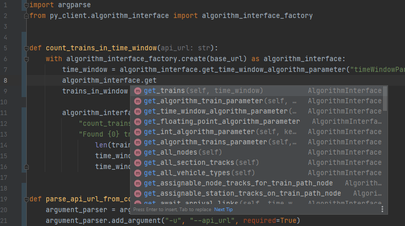

# Walkthrough Creating an Algorithm Using the py_client

In this walkthrough we will show you how to create algorithms using the [AlgorithmInterface](@py_client_root/algorithm_interface/algorithm_interface.py) via the Python client (py_client) provided with the Algorithm Platform.
                                                                                        
                                                                         

## Documentation

As the py_client strongly follows the C#-Client combined with Python's coding
conventions (according to [PEP 8]), [see the example below](../py/count_trains_py_client.py)), there is no
dedicated documentation. Instead, we refer the developer to the C# API Documentation Chapter, which is part of the documentation provided with the Algorithm Research Package. 
                                                                  

We also support
Python's type hints showing the developer the correct Python syntax and strongly supporting a rapid development:



## Installing the py_client

There are different ways of working and installing the py_client. We recommend - for each one of your projects - to
install the py_client package into a separate virtual environment at the same directory level as your main script. We
show in the following how to accomplish this assuming Python is in the path.

We proceed in three steps.

* Creating the environment,
* activating it and
* installing the py_client package with the installation tool pip into the virtual environment.

The official Python release provides all needed tools / scripts / modules. Change to a directory where you want
to develop your algorithm. We assume we are in the following directory:

```
${FolderToAlgorithmPlatform}\\Extension\\AlgorithmPlatform\\algorithms
```

The following commands cover the three steps above:

```shell
rem Step 1: create environment
python -m venv demo_venv
rem Step 2: activate environment                                          
demo_venv\Scripts\activate.bat 
rem Step 3: install py_client package and its dependencies copied to same directory previously
pip install sma.algorithm_platform.py_client-{py_client-version}.whl
```

## Counting Trains with the py_client

Having installed the py_client we can start to develop our algorithm. Just import
the [AlgorithmInterface](@py_client_root/algorithm_interface/algorithm_interface.py)
and use it by putting it into a `with` statement. Then you can use all available methods. The example code shows how to
query all [AlgorithmTrain](@py_client_root/aidm/aidm_algorithm_classes.py) in a given [TimeWindow](@py_client_root/aidm/aidm_time_window_classes.py), counts them and sends a message to the user reporting the number. You can [download this sample](../py/count_trains_py_client.py).

@Import(walkthroughs/py_client_usage/py/count_trains_py_client.py,count_trains_py_client,count_trains_py_client source code)

## Configuration for the Deployment

See the chapter '_Deployment and Parameter Passing_' in the official Algorithm Platform documentation for how to deploy an
algorithm. Here, we give a sample configuration to make our algorithm run, assuming we have set up the
environment `demo_env` as described in the [previous paragraph](#installing-the-py_client) and
that the algorithm is saved under

```
${FolderToAlgorithmPlatform}\\Extension\\AlgorithmPlatform\\algorithms\\count_trains_py_client.py
```
Then we may save the algorithm configuration in the [algorithms.json](../config/algorithms.json):

```json
{
  "name": "Count Trains in time window (py_client)",
  "startupRestInterfaceOnly": false,
  "parameterDescriptions": [
    {
      "key": "timeWindowParameter",
      "label": "Time Window Parameter",
      "type": "TimeWindow",
      "tooltip": "Defines the time-window to count the trains in."
    }
  ],
  "workingDirectory": "../algorithms",
  "files": [
    "count_trains_py_client.py"
  ],
  "command": "demo_venv\\Scripts\\python.exe",
  "arguments": "{File[0]} -u {ApiUrl}"
}
```