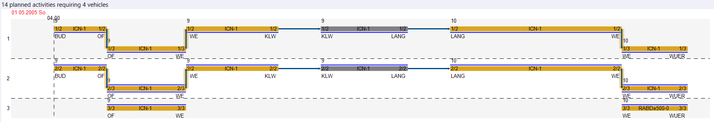

# Rostering Walkthrough

The goal of this walkthrough is to present to the algorithm developer all building blocks that they need in order to provide an algorithm for roster optimisation using the Algorithm Platform. 

If you are not familiar with the creation of algorithms with the Viriato interface, we recommend following first the
[Walkthrough Creating an Algorithm Using the py_client](../../py_client_usage/dist/py_client_usage.md).

**Overview**

We are going to implement a greedy algorithm which is able to link two trains even if they have formation changes and to create an empty run if necessary.

Here, we will proceed in three steps.
* Give a [domain data model](#proposed-domain-model) for rostering,
* [Create roster links](#creating-links) from the links in the domain model
* We show how to [create empty runs](#creating-empty-runs).

## The Working Example

We use an example to explain how the algorithm works. 
 
Suppose we have the following initial situation with two trains. Each train has at least one formation change.
* **First train:** (On the left part of Figure 1, departing at 4:00 am)
    - Traveling from Buchs-Dällikon (BUD) to Otelfingen Rietholz (OF) composed of two pieces of rolling stock of type ICN
    - From Otelfingen Rietholz (OF) to Wettingen (WE) composed of three ICN
    - From Wettingen (WE) to Killwangen-Spreitenbach (KLW) with two ICN

* **Second train:** (On the right part in the picture)
    - Traveling from Langacher (LANG) to Wettingen (WE) with two ICN
    - From Wettingen (WE) to Würenlos (WUER) composed of two ICN and a RABDe500
    
Observe that the first train has its formation changes in OF and WE in the examples, whereas the second train has the formation change in WE.

_Figure 1: Two unlinked trains with formation changes._

The algorithm proposed throughout this article will create the roster links depicted in Figure 2. The links are represented by the arrows in the picture.

_Figure 2: The two trains with roster links created by the algorithm presented in this article._

As the arrival node of the first train (KLW) is different from the departing node of the second train (LANG), an empty run has been created in grey to link the activities.
During this walkthrough, we will explain step-by-step the creation of a greedy algorithm producing these links.

## Parameters
The algorithm presented during this walkthrough takes as input two trains selected by the user in the algorithm interface of Viriato and creates links. 

_Figure 3: The user can choose two trains to be linked together._

We have attached the configuration [algorithms.json](../source/algorithms.json) that you can use for selecting 
the trains, as presented in Figure 3, in order to run this walkthrough. 

## Proposed Domain Model

We propose to use _common activities_ and _single activities_. Each common activity represents a route of a train without formation change. A common activity is composed of one or several single activities. Each single activity represents 
a piece of rolling stock running on the network between the nodes of the corresponding common activity. The picture below presents our trains decomposed in common activities and single activities. 

_Figure 4: Decomposition of the two trains in common activities and single activities._

During the rest of our walkthrough we will use this domain model with common and single activities. We will create these from the given trains and subsequently link the single activities.

We design the class _CommonActivityFactory_ to create both types of activities. The following function of this class takes as input a train and returns the list of corresponding common activities.

@Import(walkthroughs/rostering/source/CommonActivitiesFactory.py,to_common_activities,CommonActivitiesFactory source code)

With the helper function @ImportInlineShort(walkthroughs/rostering/source/CommonActivitiesFactory.py,__calculate_train_path_node_with_change_of_formation) we determine a list of train path nodes, where the formation changes, i.e. the formation of a train at a given train path node is different from the formation at the previous train path node. 
In the picture you can see this where common activities start or end. Therefore, by creating a list of pairs of subsequent train path nodes with formation changes (_departure_and_arrival_node_pairs_of_common_activities_) we can find the departure and arrival nodes of the common activities.

We invoke

@Import(walkthroughs/rostering/source/CommonActivitiesFactory.py,create_single_activities,CommonActivitiesFactory source code)

to create all single activities for this common activity. We read out the vehicles from the formation at the departure node and obtain a single activity for each one.

## Creating Links

With the proposed domain model, roster links can be created by linking single activities together. The proposed greedy algorithm works as follows.

* Roster links within a train: We link the single activities of two common activities of one train, where there is a change in formation.
* Roster links between the two trains: The single activities of the last common activity of the preceding train are linked to the single activities of the first common activity of the succeeding train.

To simplify the algorithm, we do not take into account other potential links. Given two common activities, 
we give the following method to link their single activities together. As arguments, it takes the last common activity of 
the preceding train and the first common activity of the succeeding train. It is used at each formation change within a 
train run.

The function @ImportInlineShort(walkthroughs/rostering/source/SimpleRosteringExample.py,create_link_definitions_between_two_common_activities) will iterate over all the single activities of the source common activity and looks for a single activity with a common rolling stock type in the target common 
activity. For each match, a new roster link definition is created that can be written back to the Algorithm Platform to create the links in the Figure 1. 

A _roster link definition_ is an object of the py_client defined between two pieces rolling stock at given train path nodes. The position is the index of the given rolling stock in the train formation. 

@Import(walkthroughs/rostering/source/SimpleRosteringExample.py,AlgorithmRosterLinkDefinitionExample,AlgorithmRosterLink definition example usage)

## Creating Empty Runs

In the case where the preceding train does not arrive at the departure node of the succeeding train, an empty run is needed to bring the rolling stock to the departure node. Defining a realistic empty run is not straightforward and left to the algorithm developer. 
In our walkthrough we use a strongly simplified model in order to yield the desired output. However, we do not claim that these empty runs are realistic. We use the _EmptyRunCreator_ to create empty runs with the function @ImportInlineShort(walkthroughs/rostering/source/EmptyRunCreator.py,create_empty_run_common_activity).

With the method @ImportInlineShort(walkthroughs/rostering/source/EmptyRunCreator.py,__create_empty_run_train), an empty run is created as a copy of an existing train _template_for_empty_run_ where the original route has been overridden by the shortest path between the two train path nodes: the last one of the preceding train and the first one of the succeeding train.
In order to keep the algorithm simple, the empty run is created with exactly the same formation as the preceding train.

Moreover, the duration of this empty run is somewhat arbitrarily defined to be the half of the available time between the two trains. With the method @ImportInlineShort(walkthroughs/rostering/source/EmptyRunCreator.py,__update_times_on_empty_run), we calculate the updated times of the created train and send it as an _UpdateStopTimesTrainPathNode_ to the Algorithm Platform.

Afterwards, we set the movement type of the created train to be of type "empty run" so that the activities are marked as empty runs in Viriato. Then, we can create roster links between the trains and the empty runs, as presented in the [previous section](#creating-links).