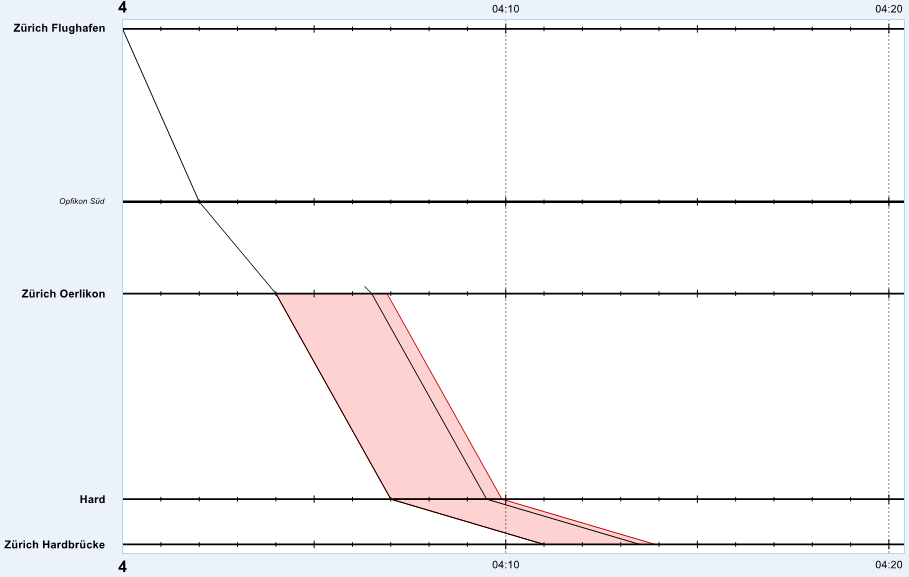
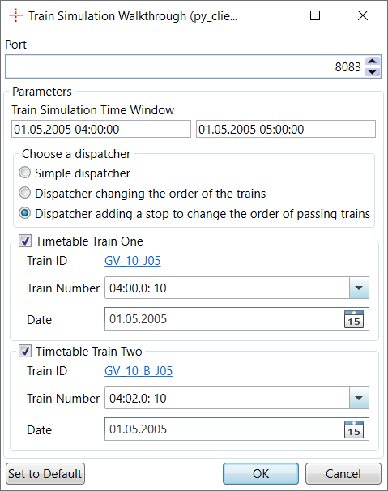
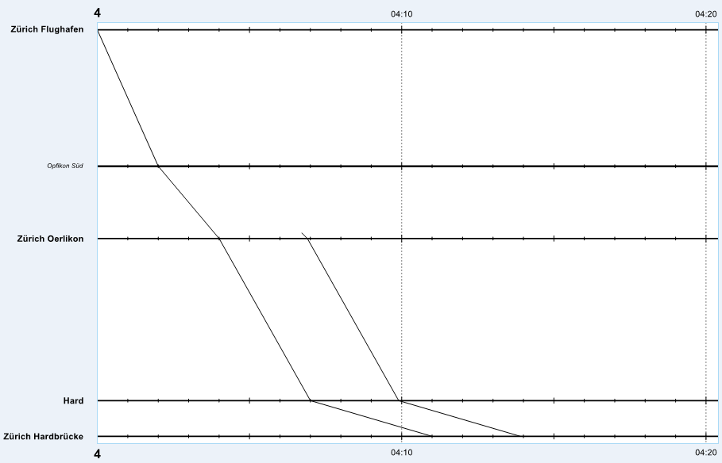
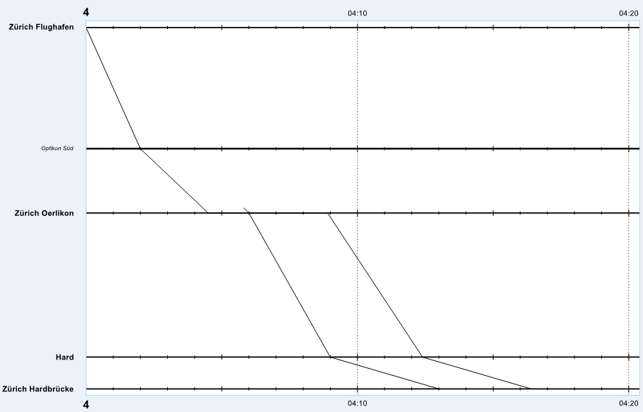

# Train Simulation Walkthrough
This walkthrough demonstrates how the Viriato train simulation can be used and how to implement an own dispatching strategy.

To have a good understanding of this walkthrough, it is recommended that
* you are familiar with the concepts presented in [Walkthrough Creating an Algorithm Using the py_client](../../py_client_usage/dist/py_client_usage.md).
* have read the article from Chapter _Train Simulation_ in the documentation provided with the Algorithm Research SDK.

## Overview

In this article, we are going to implement three different version of a dispatching strategy - referred to as dispatchers in the following - in order to outline the functionality as well as suggest ways of usages.

* We will start with a simple dispatcher prioritising events according to their chronological order.
* We will provide an extension of the first dispatcher to demonstrate how to change the order of two trains in a station where they have a planned stop, leading to a second dispatcher.
* The last dispatcher will show you how to add unplanned stops and then to use these stops to change the order of the trains, which is a natural extension of the second dispatcher.

## The Working Example

Throughout our example, we will use the following sample data to explain how the algorithm works and illustrate the different strategies.

We have two trains:
* First train: travelling between Zurich Flughafen to Zurich Hardbrücke.
* Second train: travelling between Zurich Affoltern to Zurich Hardbrücke.

Both trains share the following nodes on their route
* Zurich Oerlikon
* Hard
* Zurich Hardbrücke

Therefore, if the preceding train is delayed a conflict can occur between the two trains, see Figure 1.



_Figure 1: Example of a conflicting situation occurring during the simulation._

In the following we will give different examples, how you can implement your own dispatcher to resolve such conflicts using different methods available on the Algorithm Interface.

## The Glue Code

### Parameters

The presented algorithms request the following parameters:

* The simulation will run in a given time window.
* The user can choose the dispatcher he wants to use to solve conflicts.
* The user can optionally enter two trains of the given scenario. The algorithm will change the order of these trains.



_Figure 2: The user chooses a time window to run the simulation on and if desired the order of two conflicting trains can be changed by selecting the two concerned trains._

### Simulation
First, the simulation has to be started in a time window by the algorithm developer and in our example this time window is given by the user. This loads the timetable data in the given time window for the trains stemming from the reference scenario 
with which the Algorithm Platform has been started. Recall, that for each train path node from each of these trains either two event, one arrival and one departure event, 
or one passing event is created for the simulation. 

```python
time_window = algorithm_interface.get_time_window_algorithm_parameter("trainSimulationTimeWindow")
algorithm_train_simulation_creation_arguments = AlgorithmTrainSimulationCreationArguments(time_window=time_window)
algorithm_interface.create_train_simulation(algorithm_train_simulation_creation_arguments=algorithm_train_simulation_creation_arguments)

```
Code listing: _Starting a simulation in a given time window_. ([Lines: 20 - 22 from file: _train_simulation_example_runner.py_](../../../walkthroughs/train_simulation/py/train_simulation_example_runner.py#L20-L22)).

We can retrieve the first executable [AlgorithmTrainSimulationEvent](../../../py_client/aidm/aidm_train_simulation_classes.py) from the Algorithm Interface by using the method 
[get_next_train_simulation_event(...)](../../../py_client/algorithm_interface/algorithm_interface.py#L651-L651). 

For each event we retrieve a [dispatcher](#Dispatchers) has to decide if they want to realise it using [realize_next_train_simulation_event(...)](../../../py_client/algorithm_interface/algorithm_interface.py#L656-L656)
or to postpone it using [postpone_next_train_simulation_event(...)](../../../py_client/algorithm_interface/algorithm_interface.py#L696-L696). After making the decision we will be provided the next executable event, 
which is an instance of the type [AlgorithmTrainSimulationRealizationForecast](../../../py_client/aidm/aidm_train_simulation_classes.py). The objects of this class contain also all events that had to be postponed by the simulator in order to avoid conflicts. Finally, 
after all events have been realised the simulation terminates.

```python
realization_forecast = algorithm_interface.get_next_train_simulation_event()
while realization_forecast.next_realizable_event is not None:
    algorithm_interface.show_status_message("Simulating at {}".format(realization_forecast.next_realizable_event.forecast_time))
    realization_forecast = dispatcher.make_decision_for_event(realization_forecast.next_realizable_event)

```
Code listing: _Main loop to control the simulation_. ([Lines: 29 - 32 from file: _train_simulation_example_runner.py_](../../../walkthroughs/train_simulation/py/train_simulation_example_runner.py#L29-L32)).

## Dispatchers
A dispatcher makes for each step of the simulation a decision of what to do with an event. We use an abstract class with a method 
[make_decision_for_event(...)](../../../walkthroughs/train_simulation/py/dispatchers.py#L24-L24) respecting the following structure. This allows us to implement 
different dispatchers and to switch easily between them. 
```python
class _Dispatcher:
    @abstractmethod
    def make_decision_for_event(self, simulation_event: AlgorithmTrainSimulationEvent) -> AlgorithmTrainSimulationRealizationForecast:
        pass


```
Code listing: _Structure of the dispatchers_. ([Lines: 22 - 27 from file: _dispatchers.py_](../../../walkthroughs/train_simulation/py/dispatchers.py#L22-L27)).

### Simple dispatcher
The first dispatcher will just realise the events in a first-come first-served manner. In other words, it gives priority to the trains arriving or departing first and 
lets the simulator solve conflicts by delaying a following events if a conflict would occur otherwise, i.e. to avoid conflicts.

```python
class SimpleDispatcher(_Dispatcher):
    _algorithm_interface: AlgorithmInterface

    def __init__(self, algorithm_interface: AlgorithmInterface):
        self._algorithm_interface = algorithm_interface

    def make_decision_for_event(self, simulation_event: AlgorithmTrainSimulationEvent) -> AlgorithmTrainSimulationRealizationForecast:
        return self._algorithm_interface.realize_next_train_simulation_event()


```
Code listing: _Simple dispatcher_. ([Lines: 29 - 38 from file: _dispatchers.py_](../../../walkthroughs/train_simulation/py/dispatchers.py#L29-L38)).

This strategy can be illustrated with the example presented in Figure 3. Here, the conflict has been solved by adding additional running time to the succeeding 
train between Zurich Seebach and Zurich Oerlikon. The headway time is then respected. 



_Figure 3: Visualisation of the simple dispatcher strategy._

### Order Changing dispatcher
Let us now see how the order of two trains in their first common node can be changed. We extend the planned stop of the preceding train using 
[postpone_next_train_simulation_event(...)](../../../py_client/algorithm_interface/algorithm_interface.py#L696-L696) on the departure event of the first common 
node of the two selected trains.

```python
class ChangeTrainOrderInFirstCommonTrainPathNodeDispatcher(_Dispatcher):
    _algorithm_interface: AlgorithmInterface
    _preceding_train: AlgorithmTrain
    _tpn_first_common_node_preceding_train: AlgorithmTrainPathNode
    _tpn_first_common_node_succeeding_train: AlgorithmTrainPathNode
    _dispatcher_service: DispatcherService

    def __init__(
        self,
        algorithm_interface: AlgorithmInterface,
        preceding_train: AlgorithmTrain,
        tpn_first_common_node_preceding_train: AlgorithmTrainPathNode,
        tpn_first_common_node_succeeding_train: AlgorithmTrainPathNode,
    ):
        self._algorithm_interface = algorithm_interface
        self._preceding_train = preceding_train
        self._tpn_first_common_node_preceding_train = tpn_first_common_node_preceding_train
        self._tpn_first_common_node_succeeding_train = tpn_first_common_node_succeeding_train
        self._dispatcher_service = DispatcherService(algorithm_interface)

    def make_decision_for_event(self, simulation_event: AlgorithmTrainSimulationEvent) -> AlgorithmTrainSimulationRealizationForecast:
        return self._dispatcher_service.postpone_departure_in_given_node_of_preceding_train_or_realize_event(
            simulation_event, self._preceding_train, self._tpn_first_common_node_preceding_train, self._tpn_first_common_node_succeeding_train
        )


```
Code listing: _Dispatcher changing the train order_. ([Lines: 40 - 65 from file: _dispatchers.py_](../../../walkthroughs/train_simulation/py/dispatchers.py#L40-L65)).


For sake of simplicity we have chosen to postpone the departure one minute after the current forecast on the departure of the previously succeeding train, changing the order of the two trains through this. For further details, refert to [_calculate_time_to_postpone_to(...)](../../../walkthroughs/train_simulation/py/dispatcher_service.py#L75-L75)

```python
def postpone_departure_in_given_node_of_preceding_train_or_realize_event(
    self,
    simulation_event: AlgorithmTrainSimulationEvent,
    preceding_train: AlgorithmTrain,
    preceding_tpn_at_given_node: AlgorithmTrainPathNode,
    succeeding_tpn_at_given_node: AlgorithmTrainPathNode,
) -> AlgorithmTrainSimulationRealizationForecast:
    if self._need_to_postpone_preceding_tpn(simulation_event, preceding_tpn_at_given_node, succeeding_tpn_at_given_node):
        node_code = self._algorithm_interface.get_node(preceding_tpn_at_given_node.node_id).code
        self._algorithm_interface.notify_user(
            WALKTHROUGH_NAME,
            "Train {} departing from first node at {}: departure postponed at node {}.".format(
                preceding_train.code, preceding_train.train_path_nodes[0].departure_time, node_code
            ),
        )
        time_to_postpone_preceding_train = self._calculate_time_to_postpone_to(simulation_event, succeeding_tpn_at_given_node)
        return self._algorithm_interface.postpone_next_train_simulation_event(time_to_postpone_preceding_train)
    return self._algorithm_interface.realize_next_train_simulation_event()

```
Code listing: _Example of a dispatcher changing the order of two trains by postponing the departure of the preceding train_. ([Lines: 21 - 41 from file: _dispatcher_service.py_](../../../walkthroughs/train_simulation/py/dispatcher_service.py#L21-L41)).

### Dispatcher Adding a Stop to Change the Order of Passing Trains
If a train doesn't have a planned stop and the dispatching strategy still wants to delay the departure on the first common node, there is the possibility to add an unplanned stop by using the 
method [replace_next_train_simulation_event_by_stop(...)](../../../py_client/algorithm_interface/algorithm_interface.py#L703-L703). This method will replace a passing 
event by an arrival and a departure event. The latter can then be postponed in the same way as the dispatcher presented just above.

```python
class ChangeTrainOrderInFirstCommonTrainPathNodeAddingAStopDispatcher(_Dispatcher):
    _algorithm_interface: AlgorithmInterface
    _preceding_train = AlgorithmTrain
    _tpn_first_common_node_preceding_train: AlgorithmTrainPathNode
    _tpn_first_common_node_succeeding_train: AlgorithmTrainPathNode
    _dispatcher_service: DispatcherService

    def __init__(
        self,
        algorithm_interface: AlgorithmInterface,
        preceding_train: AlgorithmTrain,
        tpn_first_common_node_preceding_train: AlgorithmTrainPathNode,
        tpn_first_common_node_succeeding_train: AlgorithmTrainPathNode,
    ):
        self._algorithm_interface = algorithm_interface
        self._preceding_train = preceding_train
        self._tpn_first_common_node_preceding_train = tpn_first_common_node_preceding_train
        self._tpn_first_common_node_succeeding_train = tpn_first_common_node_succeeding_train
        self._dispatcher_service = DispatcherService(algorithm_interface)

    def make_decision_for_event(self, simulation_event: AlgorithmTrainSimulationEvent) -> AlgorithmTrainSimulationRealizationForecast:
        if self._dispatcher_service.event_of_preceding_train_is_passing_at_given_node(simulation_event, self._tpn_first_common_node_preceding_train):
            node_code = self._algorithm_interface.get_node(self._tpn_first_common_node_preceding_train.node_id).code
            self._algorithm_interface.notify_user(
                WALKTHROUGH_NAME,
                "Train {} departing from first node at {}: stop introduced at node {}.".format(
                    self._preceding_train.code, self._preceding_train.train_path_nodes[0].departure_time, node_code
                ),
            )

            return self._algorithm_interface.replace_next_train_simulation_event_by_stop()
        else:
            return self._dispatcher_service.postpone_departure_in_given_node_of_preceding_train_or_realize_event(
                simulation_event, self._preceding_train, self._tpn_first_common_node_preceding_train, self._tpn_first_common_node_succeeding_train
            )

```
Code listing: _Dispatcher adding an extra stop_. ([Lines: 67 - 101 from file: _dispatchers.py_](../../../walkthroughs/train_simulation/py/dispatchers.py#L67-L101)).

The strategy of this dispatcher is illustrated in Figure 4. An unplanned stop has been introduced and the departure of this train is one minute after the end
of the conflict between the two trains.



_Figure 4: Visualisation of the solution given by the proposed dispatcher changing the order and adding an extra stop._

## Writing Back the Realized Train Runs
In order to analyse and visualize the simulation, we show a method how to persist the realised train runs. For this, it is necessary to iterate over all the train path nodes and update the 
arrival time, departure time and the stop status if an unplanned stop has been introduced during the simulation. We write back the updates through method
[update_train_times(...)](../../../py_client/algorithm_interface/algorithm_interface.py#L293-L293) of the Algorithm Interface. The changed trains can then be saved to a regular Viriato train scenario, persisting the realised train runs. 
The user can visualize them in all Viriato views.

```python
def _persist_updated_trains(algorithm_interface: AlgorithmInterface, time_window: TimeWindow) -> None:
    all_trains = algorithm_interface.get_trains(time_window)
    all_train_simulations_trains = algorithm_interface.get_train_simulation_trains()

    realized_arrival_times_by_tpn_id = dict()
    realized_departure_times_by_tpn_id = dict()
    for simulation_train in all_train_simulations_trains:
        for event in simulation_train.events:
            if event.type == AlgorithmTrainSimulationEventType.passing or event.type == AlgorithmTrainSimulationEventType.arrival:
                realized_arrival_times_by_tpn_id[event.algorithm_train_path_node_id] = event.forecast_time
            if event.type == AlgorithmTrainSimulationEventType.passing or event.type == AlgorithmTrainSimulationEventType.departure:
                realized_departure_times_by_tpn_id[event.algorithm_train_path_node_id] = event.forecast_time

    for train in all_trains:
        updated_train_path_nodes = []

        for train_path_node in train.train_path_nodes:
            stop_status = _determine_stop_status(
                train_path_node, realized_arrival_times_by_tpn_id[train_path_node.id], realized_departure_times_by_tpn_id[train_path_node.id]
            )

            updated_train_path_node = UpdateTimesTrainPathNode(
                train_path_node.id,
                realized_arrival_times_by_tpn_id[train_path_node.id],
                realized_departure_times_by_tpn_id[train_path_node.id],
                None,
                None,
                stop_status,
            )
            updated_train_path_nodes.append(updated_train_path_node)
        algorithm_interface.update_train_times(train.id, updated_train_path_nodes)


```
Code listing: _Writing back the result of the simulation_. ([Lines: 41 - 73 from file: _train_simulation_example_runner.py_](../../../walkthroughs/train_simulation/py/train_simulation_example_runner.py#L41-L73)).

## Conclusion
Throughout this walkthrough we have presented how to create a simulation for a given scenario using the Algorithm Interface and how to implement different dispatching 
strategies by adding an unplanned stop and extending a stop to resolve conflicts. The presented examples only delay departure events. It is of course possible to 
postpone arrival events in an analogous way.


